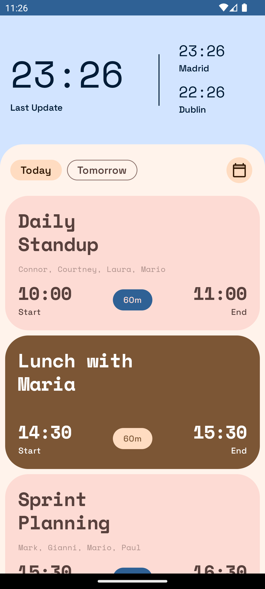
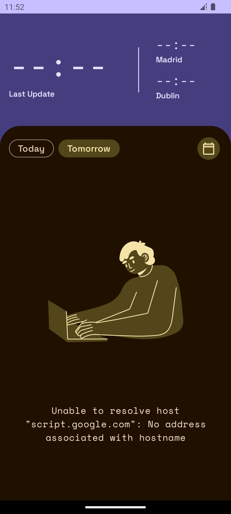
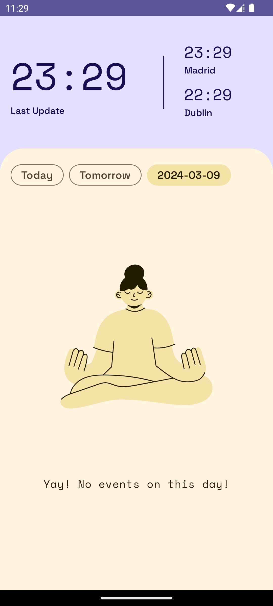

# spicy-mayo

Android app to check a Google Calendar without the need to add its Google account to the phone. Account authentication managed through a simple Google Apps Script backend.

Its main use-case is to check Today, Tomorrow or any other specific day of your work calendar, without adding your work account to your phone.

Since the backend needs to be setup on the acount of the Google Calendar to be viewed and the app needs to be setup with the url of the backend, the app can't just be download but it needs to be built as following.

### Screenshots

 <table>
  <tr>
    <th>Events</th>
    <th>Error</th>
    <th>Empty</th>
  </tr>
  <tr>
    <td></td>
    <td></td>
    <td></td>
  </tr>
</table> 

## How to setup

1. Using the Google account of the calendar to be accessed, create a new project on [Google Apps Script](https://script.google.com/home)
2. In the **Services** tab, add the <i>Google Calendar API</i> to the project
3. Copy the content of [spicy-mayo.js](spicy-mayo.js) to the default file already open in the editor
4. Generate a random string or use a password of choice to fill the `spicyApiKey` const, then save the project
5. Deploy the script as **"type"** <i>Web App</i>, choosing to **"execute as"** <i>Me <sub><sup>(email)</sup></sub></i>, with **"Who has access"** to <i>Anyone</i>
6. Add the obtained Deployment ID and the Api key generated previously to your `~\.gradle\local.properties` file:

  ```properties
  # spicy-mayo Apps Script properties
  spicyDeployId="deployment_id_obtained_from_google_apps_script"
  spicyApiKey="randomly_generated_key_to_copy_also_in_uploaded_script"
  ```
7. Clone the project and open it using Android Studio, then build the app and enjoy it

## Contribute

The project is very specific to my requirements, it could be a lot more generic, so if you need any feature feel free to fork the project and continue by yourself or open a Pull Request. There are a few things I'd like to do which likely I will never get to, because the app fulfills my needs as-is, but which you can help with:

* [ ] Add a dependency injection framework (Koin so the project can be multiplatform) to avoid recomposition for lifecycle events
* [ ] Add local cache of the days data, add a ViewPager to scroll between the days and add pull to refresh
* [ ] Migrate from Retrofit to Ktor and make the project multiplatform

Some other ideas to make the app generic, which you can contribute to:

* [ ] Make the cities changeable by clicking on top of them and showing a selector
* [ ] Make the event types and their colors user configurable
