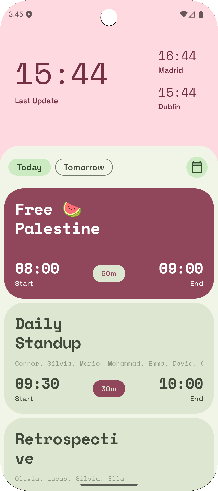
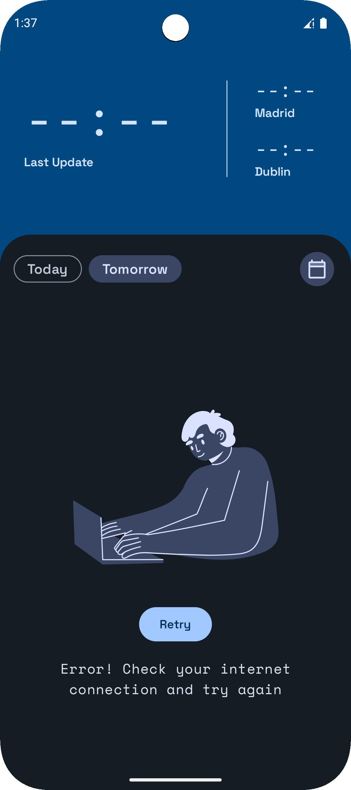

# spicy-mayo

iOs, Android and desktop app to check a Google Calendar without the need to add its Google account to the phone.
Authentication and data retrieval are managed through a simple Google Apps Script backend.

Its main use-case is to check Today, Tomorrow or a specific day of your work calendar, without adding your Google work account to your phone.

Since the backend needs to be setup on the account of the Google Calendar owner, and the app needs to be setup with the your own backend url, it can't be download but it needs to be built as explained in the next section.

### Screenshots

 <table>
  <tr>
    <th>Events</th>
    <th>Error</th>
    <th>Empty</th>
  </tr>
  <tr>
    <td></td>
    <td></td>
    <td></td>
  </tr>
  <tr>
    <td></td>
    <td></td>
    <td></td>
  </tr>
</table>

The screenshots are displaying
- the dark and light theme following the user's system preference (iOs, Android)
- different themes following the Material You user colors (Android)
- the three different types of day that can be shown (today, tomorrow or a specific date)
- the three different states the screen can be in (w/ events, empty state, error state)

## How to setup

1. Using the Google account of the calendar to be accessed, create a new project on [Google Apps Script](https://script.google.com/home)
2. In the **Services** tab, add **Google Calendar API** to the project
3. Copy the content of [spicy-mayo.js](spicy-mayo.js) to the default file in the editor
4. Generate a random string or use a password of choice to fill the `spicyApiKey` const, then save the project
5. Deploy the script as **"type"** <i>Web App</i>, choosing to **"execute as"** <i>Me (email)</i>, with **"Who has access"** to <i>Anyone</i>
6. Copy the obtained Deployment ID, and the Api key generated previously, to the [secrets.template.properties](secrets.template.properties) file in the root of the project
7. Remove the template extension from the file, so to have as result the `secrets.properties` file, which is ignored by git not to expose any secrets
8. Build the app and enjoy it

## Contribute

The project is very specific to my requirements, it could be a lot more generic, so if you need any feature feel free to fork the project and continue by yourself or open a Pull Request.
Check the repo's [issues](/../../issues) to find some good first issues and other ideas.
